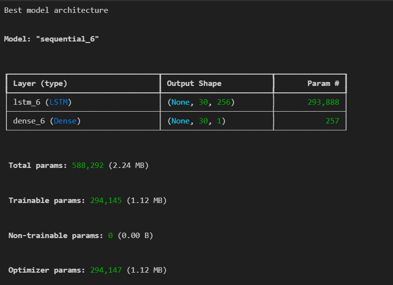
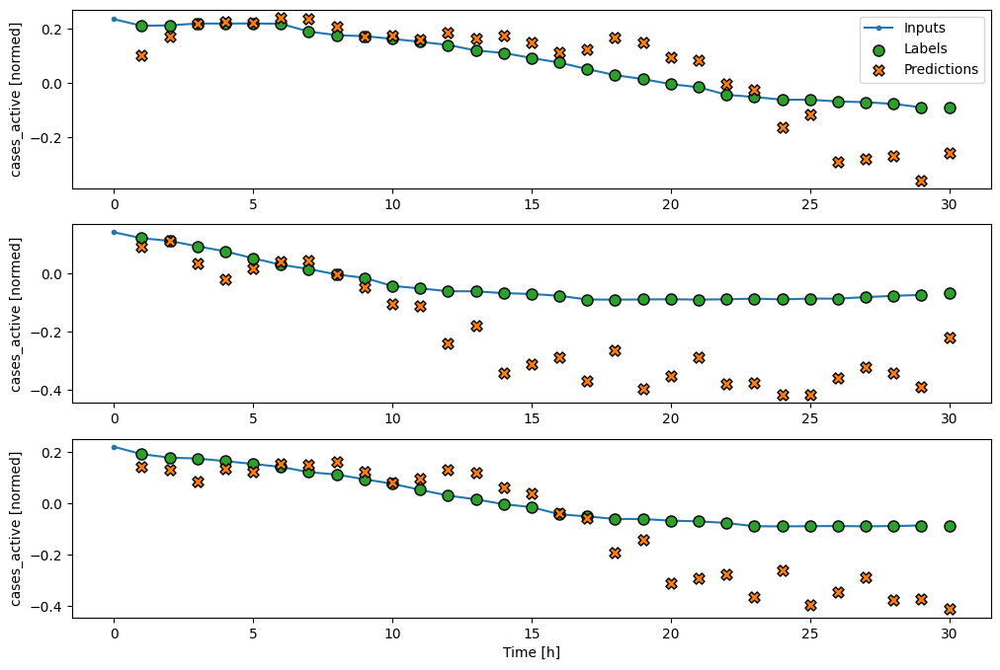
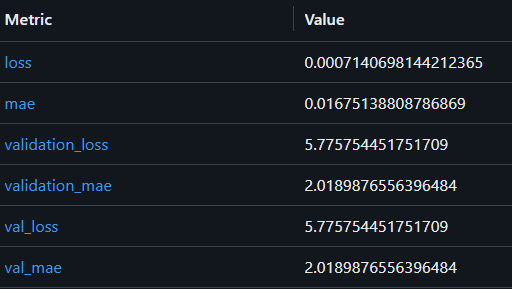

# Using Deep Learning for Predicting Covid-19 Cases in Malaysia
This project shows on how to perform prediction for Covid-19 Cases based on previous number of cases.

## Project Description
1. Objective: Leverage Long Short-Term Memory (LSTM) networks to forecast future COVID-19 cases based on historical data, offering valuable insights to support public health management.

2. Methodology: Gather and preprocess COVID-19 case data, train an LSTM model to analyze temporal patterns, and evaluate its performance using metrics such as Mean Absolute Error (MAE) and loss.

3. Expected Outcome: Deliver a reliable predictive model to anticipate COVID-19 trends, enabling informed decision-making for resource allocation and effective public health interventions.

## Data Windowing

The data windowing is used to separate the dataset into number of batch based on batch size. This allow the model to learn the trend and pattern from the dataset. The data windowing follow 30 input window width, 30 output window width and data offset to one.

## Model Architecture

## Predicted Output

The first, second and third batch shows the prediction and label plotted to show how far the prediction is from the label. The first and third batch prediction follow the label on the first half and then deviate from the label on the second half.

## Evaluation Metric

## Dataset link
[Covid-19 Cases in Malaysia](https://github.com/MoH-Malaysia/covid19-public)
