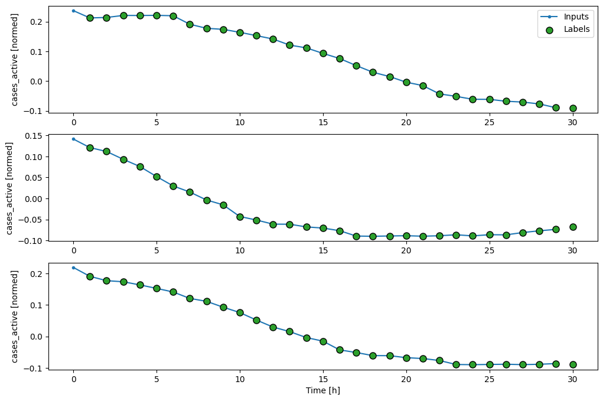

# Using Deep Learning for Predicting Covid-19 Cases in Malaysia
This project shows on how to perform prediction for Covid-19 Cases based on previous number of cases.

## Project Description
1. Objective: Use Long Short-Term Memory (LSTM) networks to predict future COVID-19 cases based on historical data, providing insights for public health management.
2. Methodology: Collect and preprocess COVID-19 data, train an LSTM model to capture temporal patterns, and evaluate performance using error metrics like MAE and RMSE.
3. Expected Outcome: Develop an accurate predictive model that forecasts COVID-19 trends, aiding in decision-making for resource allocation and public health responses.

## Data Windowing

## Predicted Output

### Dataset link
[Covid-19 Cases in Malaysia](https://github.com/MoH-Malaysia/covid19-public)
